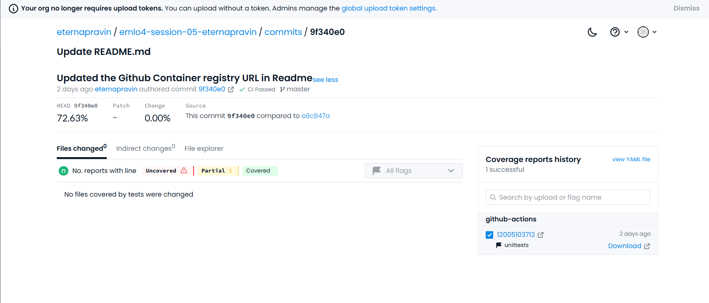

# Assignment for EMLO4 Session-05

## Contents

#### Development Requirements
#### Submission Requirements
#### Method of development
#### Results

## Development Requirements
    - Start from the repository of previous Session
    - Start using Cursor!
    - Create a eval.pyLinks to an external site. with its config that tests the model given a checkpoint
    - Integrate the infer.pyLinks to an external site. you made in last session with hydra
    - Make sure to integrate codecov in your repo, should be atleast 70%
    - Push the Docker Image to GHCR, should show up in Packages section of your repo

## Submission Requirements
    - Github Repo of your Project Link, with the exact commit id
    - Codecov link
    - GHCR link

## Method of development
    - Created seperate source files and config.yaml files for train, evaluate and infer and so all three of them can run on individual containers
    - Volume is shared across train, evaluate and infer so that the checkpoints saved after train can be used by evaluate and infer
    - Hydra is used for confiurations of the test through config.yaml files, there are default yaml files for normal runs and also experiment configuration yaml files with _ex suffix to override the default configs.
    - All the required libraries along with the version number are included as part of the pyproject.toml file
    - Tensor board and codecoverage are also integrated as part of the Project
    - test_train.py is included to test the training module and capture the code coverage and export the results.
    - The inputs to inference model are stored in infer_images folder and results are stored under infer_results

### Build command
    docker build -t dogbreed -f ./Dockerfile

### Run command to execute Train model inside a docker container
docker run -it -v /workspaces/emlo4-session-05-eternapravin/:/workspace/ dogbreed python src/train.py

### Run command to execute Evaluate model inside a docker container
docker run -it -v /workspaces/emlo4-session-05-eternapravin/:/workspace/ dogbreed python src/evaluate.py

### Run command to execute infer model inside a docker container
docker run -it -v /workspaces/emlo4-session-05-eternapravin/:/workspace/ dogbreed python src/infer.py

### Run command to execute the test script inside a docker container using the best checkpoint saved
docker run -it -v /workspaces/emlo4-session-05-eternapravin/:/workspace/ dogbreed python tests/test_train.py ckpt_path="/checkpoints/epoch_best.ckpt"

### Command to push the docker image to the GHCR
docker build . --tag ghcr.io/eternapravin/emlo4-session-05-eternapravin:latest

## Results
Github link: https://github.com/eternapravin/emlo4-session-05-eternapravin/
Code Cov link: https://app.codecov.io/github/eternapravin/emlo4-session-05-eternapravin/commit/9f340e0b9b41ed48e71bc27117bed39583ccdb22
Code Coverage Results:

GHCR link: https://github.com/eternapravin/emlo4-session-05-eternapravin/pkgs/container/emlo4-session-05-eternapravin

